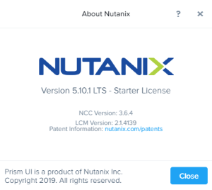
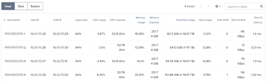
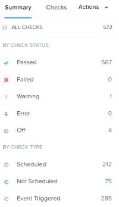
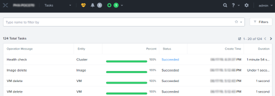

.. lab1:

----------------
Lab 1: Überblick
----------------

**In diesem Lab lernen Sie Prism Element genauer kennen und werden mit dessen Funktionen und der Benutzerführung vertraut gemacht.**

Prism Element
+++++++++++++

Der Prism Dienst stellt das Webinterface bereit um die Nutanix Cluster zu verwalten und läuft auf jeder Controller-VM (CVM). Dieser lokale Dienst, Prism Element genannt, kann durch die IP Adresse jeder einzelnen CVM oder durch die virtuelle Cluster IP Adresse (diese leitet dann zu dem aktuellem Prism Leader um) erreicht werden.

#. Rufen Sie \https://<*NUTANIX-CLUSTER-IP*>:9440 in einem neuen Browser Tab auf.

#. Melden Sie sich mit den folgenden Zugangsdaten an:

   - **username** - admin
   - **password** - <*HPOC Password*>

   .. figure:: images/nutanix_tech_overview_01.png

#. Nachdem Sie sich in Prism Element angemeldet haben, verschaffen Sie sich einen ersten Überblick über die Prism Weboberfläche. Schauen Sie sich die Informationen auf dem **Home Screen** sowie die anderen Menüpunkte unter dem Link **Home** in Ruhe an.

#. Identifizieren Sie auf dem **Home Screen** die folgenden Informationen:

   - Verwendeter Hypervisor
   - Hypervisor Version
   - Hardware Modell
   - Health (Gesundheitsstatus des Clusters)
   - VM Summary
   - Warning Alerts
   - Data Resiliency Status

   .. figure:: images/nutanix_tech_overview_02.png

#. Werfen Sie einen Blick auf die Cluster Hardware unter **Prism > Hardware**, Klick **Hardware**, dann Klick auf **Diagram**. Dort können Sie die Hardware Zusammenfassung & Details einsehen:

   - Blocks
   - Hosts
   - Memory
   - CPU
   - Disks

   .. figure:: images/nutanix_tech_overview_04.png

#. Schauen Sie sich die obere Toolbar nun etwas genauer an:

   .. figure:: images/nutanix_tech_overview_05.png

   - Health
   - Alarms
   - Tasks
   - Search
   - Help
   - Configuration
   - User

#. Starten Sie über das **Hilfe Symbol** in der Toolbar als nächstes das **Health Tutorial**  und machen Sich mit der Funktionsweise des Health Bereiches vertraut.

   .. figure:: images/nutanix_tech_overview_10.png

   .. figure:: images/nutanix_tech_overview_11.png

#. Schauen Sie sich nun die restlichen Hauptmenü-Einträge auch noch genauer an:

   .. figure:: images/nutanix_tech_overview_03.png

   - VM, Storage, Network, Hardware, File Server, Data Protection, Analysis, Alerts, Tasks, Settings, Self Service

Fragen zu Prism Element 
+++++++++++++++++++++++

Wie können Sie die verwendete **AOS-Version** herausfinden?

(Sie finden diese Information rechts oben in der Ecke unter dem Link **User** und dann unter **About Nutanix**.)

Wie würden Sie zu der folgenden Ansicht gelangen, die Ihnen eine Übersicht über die **Anzahl der Hosts**, der **Cluster Kapazität** und der **Cluster Auslastung** zeigt?

(In **Prism Element > Home**, klick **Hardware**, dann auf **Table**).

Finden Sie die Stelle, die Ihnen den folgenden Screenshot mit den **Health-Informationen** zu diesem Cluster zeigt!

(In **Prism > Home**, klick **Health**, dann klick **Summary** in der rechten Spalte.)

Finden Sie die Site, die Ihnen die **letzte Aktivität** des Systems anzeigt! Auf dieser Seite können Sie den Fortschritt aller Tasks einsehen und erkennen welche Tasks in der Vergangenheit gelaufen sind. Kennen Sie beide Wege um dorthin zu gelangen?

(In **Prism > Home**, klick auf **Tasks** oder klicken Sie auf das **"Kreis-Symbol"** in der oberen Toolbar und dann auf **View All Tasks***.

Zusammenfassung
+++++++++++++++
Prism Element ist die Nutanix "Management-Plane" / "Verwaltungs-Ebene", welche auf jedem Node des Clusters läuft und ein HTML5-Webinterface für das Cluster-Management bereitstellt. Die Oberfläche & Bedienbarkeit wurde bewusst so angelegt, dass die wichtigsten Informationen für einen Administrator intuitiv und sofort ersichtlich sind.
