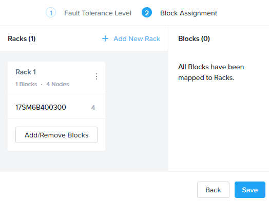

.. lab2:

----------------------------
Lab 2: Storage Konfiguration
----------------------------

**In diesem Lab werden Sie mit Prism Element basis Storage Container Operationen durchführen.**

Distributed Storage Fabric
++++++++++++++++++++++++++

Die Nutanix Distributed Storage Fabric (DSF) präsentiert sich dem Hypervisor wie jedes anderes zentrales Storage Array, nutzt aber die CVMs und lokalen Storage in jedem Node um Shared Storage für das Cluster bereitzustellen - die Kombination aus Server und verteiltem lokalem Storage ist was üblicherweise als **Hyperconverged Infrastructure (HCI)** bezeichnet wird.

.. figure:: images/dsf_overview.png

Als ein Pioneer in dem HCI Umfeld liefert die Nutanix DSF eine bewährte Lösung welche Performance und Ausfallsicherheit bietet um `viele verschiedene Anwendungen <https://www.nutanix.com/solutions/>`_ zu betreiben, z.B. Enterprise Datenbanken, virtuelle Desktops, ROBO, Big Data, etc.

Die beiden Haupt-Storage Komponenten innerhalb der DSF sind **Storage Pools** und **Storage Container**.

Der **Storage Pool** ist die Aggregierung aller physischen Disks innerhalb eines Nutanix Clusters. Das Cluster verwaltet die Verteilung der Daten, sodass **keine** zusätzliche Konfiguration von weiteren Storage Pools (wie etwa mit LUNs bei traditionellem Storage) notwendig ist. Sobald neue Nodes dem Cluster hinzugefügt werden, werden die Disks automatisch dem Pool hinzugefügt und das Cluster beginnt im Hintergrund mit `dem Umverteilen der Daten zu den neuen Disks <https://nutanixbible.com/#anchor-book-of-acropolis-disk-balancing>`_.

**Storage Container** sind Software-definierte, logische Konstrukte welche es Ihnen erlauben Storage Policies / Richtlinien für Gruppen von VMs oder vDisks zu konfigurieren (Container sind ähnlich wie Datastores in ESXi). In dem folgenden Lab werden Sie den Prozess für das Anlegen und Konfigurieren von Storage mit Nutanix Prism Element durchlaufen.

.. note::

   Um mehr über zusätzliche DSF Konstrukte wie vDisks, Extents und Extent Groups zu lernen, schauen Sie sich `diese Sektion der Nutanix Bible <https://nutanixbible.com/#anchor-book-of-acropolis-distributed-storage-fabric>`_ an.

Anlegen & Konfiguration eines Storage Containers
++++++++++++++++++++++++++++++++++++++++++++++++

#. In **Prism Element> Storage**, Klick **Storage**, Klick **Table**, dann Klick **+ Storage Container**.

#. Nutzen Sie die folgenden Parameter:

   - **Name** - *Initialen*-container
   - Auswahl von **Advanced Settings**
   - **Advertised Capacity** - 500 GiB
   - Selektieren von **Compression**
   - **Delay (In Minutes)** - 0

#. Klick **Save**.

   .. figure:: images/storage_config_01.png

   Der Storage Container steht nun allen Nodes innerhalb des Clusters zur Verfügung - ohne dass sonstige Schritte notwendig sind (kein LUN Zoning, etc. notwendig).

   In AHV erstellt der Hypervisor eine separate iSCSI Verbindung zu der DSF für jede vDisk die verwendet wird. In ESXi Umgebungen wird jeder **Storage Container** automatisch als ein NFS Datastore beim Hypervisor gemounted. Ähnlich in Hyper-V, dort ist jeder **Storage Container** als ein SMB Datastore präsentiert.

   .. note::

     Beispiel Ansicht eines **Storage Containers** aus Prism:

     .. figure:: images/nutanix_tech_overview_13.png

     Beispiel Ansicht eines **Storage Containers** (datastores) in vCenter:

     .. figure:: images/nutanix_tech_overview_14.png

   Sie können mehrere Container mit verschiedenen Policies / Richtlinien erstellen, alle nutzen die Storage Kapazität des **Storage Pool's**.

   Zum Beispiel können Sie `Deduplizierung <https://nutanixbible.com/#anchor-book-of-acropolis-elastic-dedupe-engine>`_ für einen Storage Container aktivieren, welcher für "Full Clone's" von persistenten Virtual Desktops verwendet wird. Hingegen macht Deduplizierung keinen Sinn für Anwendungen wie Datenbanken. Analog möchten Sie z.B. einen Storage Container anlegen, welcher `Erasure Coding <https://nutanixbible.com/#anchor-book-of-acropolis-erasure-coding>`_ für Archiv Daten wie Backups oder Filmmaterial aus Überwachungskamera's aktiviert hat.

#. Werfen Sie einen tieferen Blick in die Storage Container Konfiguration, indem Sie Ihre Konfiguration *updaten*. Wie würden Sie Kapazität für kritische VMs auf einem Cluster mit gemischten Anwendungen reservieren?

#. Wählen Sie verschiedene Storage Container auf dem Cluster aus und schauen Sie sich die **Storage Container Details** wie in der unten stehenden Ansicht genauer an.

   .. figure:: images/storage_config_04.png

   Diese Ansicht liefert Ihnen eine Aufschlüsselung der Kapazitätseinsparungen von jeder verfügbaren / aktivierten Data Reduction Option, sowie die **Effective Usable Capacity** des Containers. Fahren Sie mit Ihrer Maus über jeden blau hinterlegten Hyperlink für mehr Details wie sich die Einsparung zusammensetzt. Die **Data Reduction Ratio** ist die Data Reduction Efficiency wenn **lediglich** Komprimierung, Deduplizierung und Erasure Coding miteinbezogen werden. Das **Overall Efficiency** Verhältnis misst sowohl Data Reduction als auch native Datenvermeidung in DSF, insbesondere Einsparungen durch Thin Provisioning und Cloning.

   .. note::
      Interessiert wieviel logische Storage Kapazität Nutanix in verschiedenen RF2 oder RF3 Konfigurationen bereitstellen kann? Probieren Sie den `Nutanix Storage Calculator <https://services.nutanix.com/#/storage-capacity-calculator>`_ aus.

Redundancy Factor (RF)
++++++++++++++++++++++

Die Distributed Storage Fabric verwendet einen software gesteuerten Replication Factor (RF) Lösungsansatz um eine Ausfallsicherheit zu gewähleisten und steht damit im Gegensatz klassischen RAID Technologien. Standardmäßig speichert Nutanix zwei Kopien der Daten mit der Möglichkeit einen kompletten Node Ausfall zu überstehen - dies wird als **RF2** bezeichnet. Für sehr große Cluster oder kritische Workloads kann Nutanix auch 3 Kopien der Daten speichern - mit der Möglichkeit zwei Node Ausfälle zu überstehen. Dies wird als **RF3** bezeichnet.

Interessiert daran mehr über RF Schreib- und Lesevorgänge zu lernen? Schauen Sie sich das unten stehende Video genauer an!

.. raw:: html

   <iframe width="640" height="360" src="https://www.youtube.com/embed/OWhdo81yTpk" frameborder="0" allow="accelerometer; autoplay; encrypted-media; gyroscope; picture-in-picture" allowfullscreen></iframe>
RF Policies / Richtlinien werden auf Storage Container Ebene mit Prism Element erstellt.

Nutanix Cluster können auch `Verfügbarkeits-Domain Richtlinien <https://nutanixbible.com/#anchor-book-of-acropolis-availability-domains>`_ auf Block oder Rack Level einrichten. Schauen Sie sich dies in Prism Element an: **Prism Element > Settings**, dann Klick auf **Rack Configuration**.

.. figure:: images/storage_config_05.png

Weil in der Testumgebung nur 1 Block mit 4 Nodes hinterlegt ist, lässt sich nun lediglich eine Node "Fault Tolerance" simulieren (welche aber bei Default bereits gegeben ist). Nichtsdestotrotz ist es wichtig zu sehen wie einfach solche eine Konfiguration vorgenommen werden kann und daher wird einmal kurz der Prozess für Node Fault Tolerance durchlaufen (abgewandelt dann gültig für Rack oder Block Fault Tolerance möglich). Die Selektion auf **Node** belassen und auf **Next**. Danach ein **Rack anlegen & benennen** und den **Block hinzufügen**, danach auf **Save**.

Block Awareness stellt in ausreichend großen Clustern sicher, dass die zweiten Kopien der Daten nicht auf einen Knoten im gleichen Block (im gleichen physischen Gehäuse) geschrieben werden, auf welchem bereits die erste Kopie liegt. Dies erlaubt den kompletten Ausfall eines ganzen Multi-Node Blocks ohne, dass eine Daten-Nichtverfügbarkeit eintritt. Das gleiche Konzept kann für Nutanix Cluster angewendet werden, die mehrere Racks umfassen. Die Mindestanforderung für Rack / Block Fault Tolerance ist es Minimum 3 Blöcke in dem Cluster zu haben (für RF2), da wir 3 Kopien an Metadaten abspeichern.

1. Schauen wir uns nun nocheinmal den generellen RF Faktor für das gesamte vorliegende Cluster an. In **Prism > Home**, Klick **OK** in die **Data Resiliency Status** Box.

  .. figure:: images/storage_config_03.png

  .. note::
     Der Data Resiliency Status zeigt an wieviele Ausfälle ohne Auswirkungen auf das Cluster eintreten können. Jeder aufgeführte Service hat eine spezielle Funktion im Cluster, z.B. die Zookeeper Nodes schützen die Konfigurations Daten (Service States, IP's, Host Informationen, etc) für das Cluster.

2. Der RF eines Clusters kann in Prism Element konfiguriert werden: **Prism Element > Settings**, dann Klick auf **Redundancy State**

  .. figure:: images/storage_config_07.png

  .. note::
     Für diese Testumgebung den Redundancy Faktor bitte auf **RF 2 belassen**. Generell kann ein RF2 Cluster im laufendem Betrieb angepasst werden um RF3 zu unterstützen. Allerdings werden dafür minimum 5 Nodes benötigt. Wenn ein Cluster für RF3 konfiguriert ist, werden 5 Kopien an Metadaten für alle Daten erstellt - unabhängig davon ob die individuellen Storage Container als RF2 oder RF3 konfiguriert wurden.

Zusammenfassung
+++++++++++++++
Die Distributed Storage Fabric bietete eine Verfügbarkeit von Redundanz Faktor 2 (RF2) oder Redundanz Faktor 3 (RF3) für den geteilten Storage des Clusters. Storage Container erlauben Ihnen Storage Policies für VMs anzulegen welche etwa Redundanz Faktor (RF2/3), Komprimierung, Deduplizierung und Erasure Coding umfassen.
