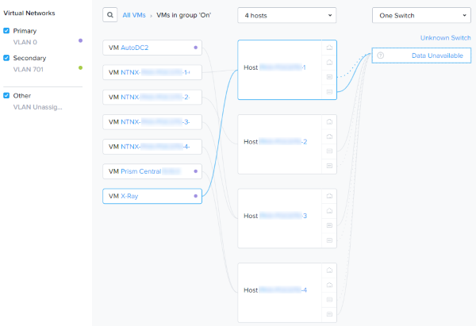
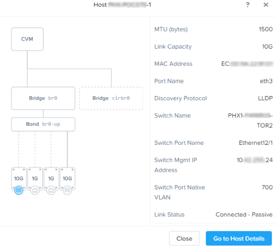
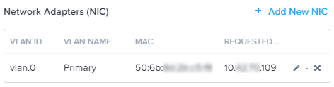
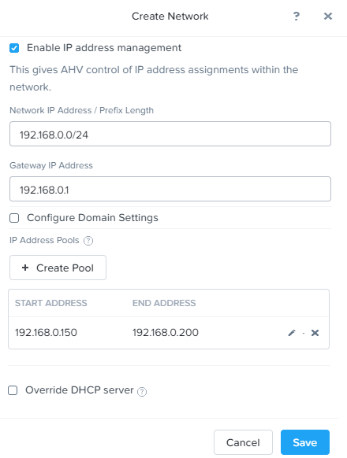

.. lab3:

-----------------------------
Lab 3: Netzwerk Konfiguration
-----------------------------
**Lernen Sie wie Sie mit Prism Netzwerk-Konnektivität im Cluster konfigurieren können. Die Netzwerke die Sie im folgenden erstellen, erlauben eine VM Konnektivität durch das Zuweisen der entsprechenden Netzwerke an die jeweiligen VM NIC's.**

AHV Netzwerk-Grundlagen
+++++++++++++++++++++++

AHV nutzt Open vSwitch (OVS) für alle VM Netzwerk Konfiguration. OVS ist ein Open Source Software Switch welcher im Linux Kernel implementiert  und speziell für eine Multiserver Virtualisierungs-Umgebung designed wurde. Jeder AHV Server hat eine OVS Instanz und alle OVS Instanzen, miteinander kombiniert, formen einen logischen Switch.

Jeder Node ist dabei typischerweise mit einem oder mehreren physischen Switch Ports verbunden, welche mehrere trunked/tagged VLANs enthalten, die dann als virtuelle Netzwerke verwendet werden.

Das ganze können Sie auch in der Prism UI sehr schön sehen: In **Prism Element > Network**.

Dort sehen Sie welche VMs mit welchen VLANs hinterlegt sind, auf welchem Host diese laufen und mit wievielen und welchen aktiven/standby Pfaden der jeweilige Host mit dem Netzwerk verbunden ist. Sie können sich jetzt auch auf dem Host die jeweilige OVS Switch Konfiguration anschauen in dem Sie auf einen Host klicken, z.B. **Host 1**:

Die VM Netzwerk Konfiguration kann durch  Prism vorgenommen werden (oder optional per CLI bzw. REST API), sodass das Netzwerk Management in AHV sehr einfach ist. In der folgenden Übung werden Sie durch die virtuelle Netzwerk-Erstellung in AHV geführt. Mit AHV können Sie ebenfalls einen DHCP einrichten der automatisch IP Adressen für VMs bereitstellt - hierfür kommt der IP Address Management (IPAM) Service zum Einsatz. Weitere Details über AHV Netzwerktechnik kann `hier <https://nutanixbible.com/#anchor-book-of-ahv-networking>`_  gefunden werden.

Virtuelle Netzwerke
--------------------
  - Ähnlich einer “distributed Switch portgroup”
  - Jede virtuelle NIC (vNIC) gehört genau zu einem virtuellen Netzwerk (vNET)
  - Jedes virtuelle Netzwerk ist die zentrale Konfigurationsstelle für eine Gruppe vNICs
  - Der physikalische Switch-Port muss als Trunk VLAN Port definiert sein

.. figure:: images/network_config_001.png

Virtual NICs
------------
  - Jede vNIC gehört genau zu einem virtuellen Netzwerk (vNET)
  - Bei Netzwerken, bei denen IPAM aktiviert ist, erhalten die vNICs lebenslange statische IP Zuweisungen
  - Nutzer können Pools konfigurieren um automatisch oder manuell IP Adressen zuzuweisen

IP Address Management (IPAM)
----------------------------
  - Integrierter DHCP Server
  - AHV fängt DHCP Anfragen von Gästen in dem IPAM Netzwerk ab und injiziert Antworten
  - Der Virtualisierungs-Admin verwaltet einen Bereich von IP Adressen
  - Unterstützt beliebige DHCP Optionen - mit UI Unterstützung für DNS und TFTP Konfigurationen

Netzwerk-Konfiguration
++++++++++++++++++++++

.. note::
   In der folgenden Übung werden Sie Netzwerke mit ungültigen VLANs anlegen über welche kein Netzwerk Traffic außerhalb des jeweiligen Host transportiert werden kann. Dieses Verhalten ist zu erwarten, da die Netzwerke in diesem Fall nur zu Übungszwecken angelegt werden sollen.

Nutzer VM Netzwerk einrichten
-----------------------------
Verbinden Sie sich mit Prism Element und erstellen ein Netzwerk für eine Nutzer VM NIC. Verwenden Sie irgendein VLAN (außer 0 und ihr Primäres / Sekundäres VLAN) und aktivieren Sie *kein IP Address Management*.

#. In **Prism Element > VM**, klick **VMs**, dann klick **Network Config**.

#. Selektieren Sie **VM Networks**, dann klicken Sie **+ Create Network**.

#. Füllen Sie die folgenden Felder aus und klicken **Save**:

   - **Name** - *Initialen*-Netzwerk
   - **VLAN ID** - ein Wert (< 4096) und nicht Ihre **Primären** oder **Sekundären** Netzwerk VLANs
   - Aktivieren Sie *kein* **Enable IP Address Management**

   Das finale Ergebnis sollte wie folgt aussehen:

   .. figure:: images/network_config_04.png

   Dieses konfigurierte virtuelle Netzwerk wird nun auf jedem Node im Cluster zur Verfügung stehen. Virtuelle Netzwerke in AHV verhalten sich wie der Distributed Virtual Switch (vDS) in vSphere, d.h. Sie müssen die Einstellungen nicht auf jedem einzelnen Host im Cluster individuell konfigurieren. Wenn Sie VMs in IPAM verwalteten Netzwerken anlegen, kann die IP optional dennoch manuell während der vNIC Erstellung spezifiziert werden.

Nutzer VM Netzwerk mit IPAM einrichten
--------------------------------------

Legen Sie ein weiteres Netzwerk an - dieses Mal allerdings mit **IPAM aktiviert**.

#. Füllen Sie die folgenden Felder aus und klicken auf **Save**:

   - **Name** - *Initialen*-Netzwerk_IPAM
   - **VLAN ID** - ein Wert (< 4096) und nicht Ihre **Primären** oder **Sekundären** Netzwerk VLANs
   - Selektieren Sie **Enable IP Address Management**
   - **Network IP Address / Prefix Length** - 10.0.0.0/24
   - **Gateway** - 10.0.0.1
   - Selektieren Sie *nicht* **Configure Domain Settings**
   - **Create Pool** - 10.0.0.100-10.0.0.150
   - Selektieren Sie *nicht* **Override DHCP Server**

   .. figure:: images/network_config_03.png
   .. figure:: images/network_config_05.png

   .. note::

     Es ist möglich mehrere Pools mit eigenen IP-Adress-Bereichen für ein Netzwerk anzulegen.

   Das konfigurierte virtuelle Netzwerk steht jetzt allen Nodes im Cluster zur Verfügung. Die vNICs der VMs auf diesem Netzwerk werden DHCP Adressen aus dem hinterlegten Adress Bereich erhalten. Diese IP Zuweisungen bleiben für die gesamte Lebensdauer der VMs bestehen. Somit werden Abhängigkeiten von DHCP Reservierungen oder statischen IPs für viele Anwendungen vermieden.

   .. note::

     Sie können die nun erstellten zwei Netzwerke, später während der Erstellung einer VM mit zwei vNICs nutzen und überprüfen, ob sich beide Netzwerke auch wie erwartet verhalten. Dazu verbinden Sie eine der beiden vNICs der VM mit dem Netzwerk welches Ihnen eine DHCP-Adresse mittels IPAM zuweist und verbinden anschließend die zweite vNIC der VM mit dem Netzwerk in dem keine IP-Adresse zugewiesen wird.

Zusammenfassung
+++++++++++++++
- Wie Sie sehen können ist es sehr einfach ein individuelles Netzwerk innerhalb eines Clusters zu erstellen.
- Auch die Erstellung eines Netzwerkes in dem IPAM mit individuellen IP-Pools genutzt werden kann ist extrem einfach und schnell zu konfigurieren. 

