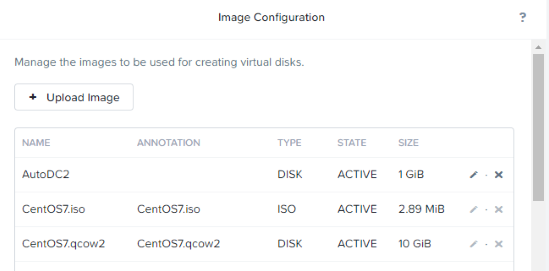

.. lab4:

----------------------------------
Lab 4: Bereitstellen von Workloads
----------------------------------

**Aus Prism Element können neben dem reinen Storage & Netzwerk Management ebenfalls VMs erstellt, verwaltet und überwacht werden.**

Image Service
+++++++++++++
Nutanix’s Image Service ist der Ort an welchem Sie Ihre Disk Images erstellen und ablegen können (ähnlich zu VMware Templates). Dieses Tool kann auch VM-Disk-Images in Formate konvertieren die AHV unterstützt. Der Image Service unterstützt raw, vhd, vhdx, vmdk, vdi, iso, qcow und  qcow2 Disk-Formate.

Schauen Sie sich in Prism Element die verfügbaren Images an, klicken Sie dafür auf das **Gear Icon** (*Zahnrad Symbol*) oben rechts und danach auf **Image Configuration**.

.. note:: Es wurden bereits einige Images und ISOs hochgeladen, sodass Sie direkt loslegen können. Beachten Sie, dass ein paar der Images in diesem Cluster von einer Prism Central Instanz verwaltet werden und daher hier nicht editiert werden können. Allerdings können Sie lokal auch weitere Images (per Datei oder URL) selbst hochladen.

Bereitstellen einer Linux-VM (Disk-Image)
+++++++++++++++++++++++++++++++++++++++++
In dieser Übung erstellen Sie eine CentOS-VM von einem existierenden, vorinstallierten Disk-Image von dem Image-Service. In vielen Umgebungen ist es üblich standardisierte, vorinstallierte Images für ein schnelles Bereitstellen von neuen VMs zu verwenden.

1.  In **Prism Element**, klick auf **VM**, klick auf **Create VM**.
2.	Füllen Sie die Eingabemasken wie folgt aus:
    - **Name** : *Initialen*-LinuxVM
    - **Description** : (Optional) Beschreibung für Ihre VM.
    - **Timezone** : (UTC + 02:00) Europe / Berlin
    -	**vCPU(s)** : 1
    -	**Number of Cores per vCPU** : 1
    -	**Memory** : 2 GiB

    .. figure:: images/createlinuxvm.png

    - Wählen Sie **+ Add New Disk**
    - **Type** : DISK
    - **Operation** : Clone from Image Service
    - **Image** : CentOS7
    - Speichern mit **Add**

    .. figure:: images/createlinuxvm-adddisk.png

    - Wählen Sie **Add New NIC**
    - VLAN Name : *Initialen***-Netzwerk_IPAM** (Ihr zuvor angelegtes IPAM Netzwerk)
    - Speichern mit **Add**
    - VM speichern mit **Save**.
    - **Filtern** Sie in der VM-Liste nach Ihrer soeben angelegten VM, **starten** Sie diese und öffnen Sie die **Konsole** (*Launch Console*).

    .. figure:: images/centos7running.png

    Wie Sie sehen ist die VM dank des vorgefertigten Disk-Images direkt mit CentOS7 einsatzbereit. Schauen Sie sich auch unter **VM Details** die IP-Adresse an, welche mittels IPAM-Service automatisch aus der von Ihnen definiertem IP-Range zugewiesen wurde.

Bereitstellen einer Windows VM (ISO)
++++++++++++++++++++++++++++++++++++
In dieser Übung werden Sie eine Windows Server VM anhand einer Windows-Installation ISOs erstellen.

Um den VMs maximale IO-Performance zur Verfügung zu stellen, benötigt AHV die Installation von paravirtualisierten Treibern in die Gast-VM (ähnlich wie bei den VMware-Tools). Insbesondere für Windows-Gast-VMs müssen diese Treiber zum Zeitpunkt der Installation geladen werden um die Disks für den Windows-Installer bereitzustellen.

Nutanix validiert und verteilt diese Treiber via Nutanix Portal (http://portal.nutanix.com). Das Nutanix ISO-Image (NGT) mit den Treibern (VirtIO) wurde bereits in den Image-Service geladen.

1.  In **Prism Element** > **VM** > **Table**, klick auf **+ Create VM**.

2.  Füllen Sie nun die folgenden Felder aus und klicken dann auf **Save**:

    - **Name** : *Initialen*-WindowsVM
    - **Description** : (Optional) Beschreibung für Ihre VM.
    - **Timezone** : (UTC + 02:00) Europe / Berlin
    - **vCPU(s)** : 2
    - **Number of Cores per vCPU** : 1
    - **Memory** : 4 GiB

    .. figure:: images/createwindowsvm.png

    - Wählen Sie das **Stift Symbol** neben **CDROM**
    - **Operation** : Clone from Image Service
    - **Image** : Windows2016.iso oder Windows2012R2.iso
    - Wählen Sie **Update**

    .. figure:: images/windowsvm-add-iso.png

    .. note:: Dies wird die Windows Server ISO von dem Image Service für die Installation einbinden.

    - Wählen Sie **+ Add New Disk**
    - **Type** : DISK
    - **Operation** : Allocate on Storage Container
    - **Storage Container** : Default
    - **Size (GiB)** : 30 GiB
    - Abschließen mit **Add**

    .. figure:: images/createwindowsvm-adddisk.png

    .. note:: Dies wird eine 30 GiB vDisk auf dem ausgewähltem Storage Container erstellen, welche als Ziel für die Windows Installation dient.

    - Wählen Sie **+ Add New Disk**
    - **Type** : CDROM
    - **Operation** : Clone from Image Service
    - **Image** : Nutanix-VirtIO-<aktuelleVersionsNummer>.iso
    - Hinzufügen mit **Add**

    .. figure:: images/createwindowsvm-add-virtio.png

    .. note:: Dies sind die Nutanix-VirtIO-Treiber für die Gast-VM.

    - Wählen Sie **+ Add New NIC**
    - **VLAN Name** : Primary
    - Wählen Sie **Add**

3.  VM speichern mit **Save**.

4.  **Filtern** Sie in der VM-Liste nach Ihrer soeben angelegten Windows-VM und **starten** Sie diese (*Power on*).

5.  Öffnen Sie als nächstes die **Konsole** (*Launch Console*) um mit der VM interagieren zu können.

6.  Durchlaufen Sie den Standard-Windows-Installations-Prozess bis Sie zu dem Punkt der *Windows Installations Location* gelangen.

   .. note:: Wählen Sie die *Windows Server 2016 Datacenter (Desktop Experience)* und *Custom: Install Windows only (advanced)* bei dem Setup Prozess aus.

7.  Klicken Sie *Load Driver* und navigieren Sie zu der CD wo die Nutanix VirtIO-Treiber geladen wurden.

8.  Durchsuchen Sie die CD und selektieren Sie das Verzeichnis welches mit der Windows-OS Installations-Version übereinstimmt (*amd64* für 64 bit auswählen).

    .. figure:: images/deploy_workloads_05.png

    .. figure:: images/deploy_workloads_06.png

9.  Wählen Sie die drei angezeigten Nutanix-Treiber aus (Halten Sie die *Ctrl* Taste gedrückt und selektieren Sie alle *drei zusammen*):
  - Balloon
  - Ethernet adapter
  - SCSI passthrough controller

    .. figure:: images/deploy_workloads_07.png

10.  Weiter mit **Next**.

11.  Nachdem die Treiber geladen wurden, erscheint die zuvor angelegte 30 GiB Disk als Installations-Ziel.

12.  Selektieren Sie die Disk und fahren Sie mit dem normalen Installationsprozess fort.

13.  Nachdem die Installation abgeschlossen wurde, kann das Windows-Installations-ISO aus dem vCD-ROM entfernt werden. Weiter können Sie auch das ISO mit den Nutanix-VirtIO-Treibern später nach vollständiger Installation ebenfalls aus dem anderen vCD-ROM entfernen.

.. note::
    Bei dem ESXi-Hypervisor würde gelten:
    Nachdem eine VM in vSphere erstellt wird, erscheint diese in der Prism-VM-Liste. Andersherum würde es genau so sein: Wenn eine VM in Prism erstellt wurde, so erscheint diese auch in der vSphere UI. Das Beispiel hierzu sieht wie folgt aus:

    .. figure:: images/deploy_workloads_08.png

14.  Nach der OS-Installation können Sie die **Nutanix Guest Tools (NGT)** Installation durchführen. Klicken Sie in Prism Element auf die VM und klicken Sie unter der VM-Liste auf **Manage Guest Tools > Enable Nutanix Guest Tools > Mount Guest Tools** und klicken Sie auf **Submit**.

    Nun steht Ihnen das NGT-Installations-ISO in der VM zur Verfügung. Das NGT-ISO enthält die zuvor installierten VirtIO-Treiber sowie weitere Dienste um *Self-Service File Restore* und Applikations-konsistente Snapshots (VSS) zu ermöglichen.

    .. figure:: images/NGT1.png

15.  Kehren Sie zurück in die VM Konsole um die NGT-Installation durch einen Klick auf die **Nutanix Guest Tools CD** und die darauffolgende *Installations-Routine (Setup)* zu starten.
     
     .. figure:: images/NGT2.png

Zusammenfassung
+++++++++++++++
In diesem Lab konnten Sie nun feststellen, wie einfach man eine Linux- und Windows-basierte-VM erstellen kann. Der Image-Service erlaubt es Ihnen einen Katalog an verfügbaren Images für Ihre VM-Bereitstellung anzulegen und unterstützt eine Vielzahl unterschiedlichster Formate (inkl. qcow, qcow2, vmdk, VHD, VHDx, RAW und ISO).
