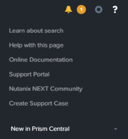
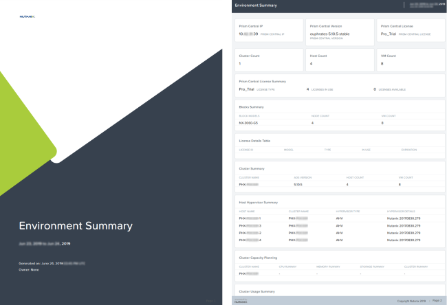

.. lab7:

--------------------
Lab 7: Prism Central
--------------------

**In diesem Lab erfahren Sie nun einiges über die Prism Central Multi-Cluster-Verwaltung, die Suchfunktionalität, die Überwachung und Ressourcen Planung die Ihnen dabei hilft Engpässe zu vermeiden und zukünftiges Wachstum perfekt planen zu können**. 

Nachdem Sie sich in *Prism Central* eingeloggt haben, machen Sie sich zunächst mit der Oberfläche von Prism Central vertraut. Schauen Sie sich die Informationen auf dem Dashboard an und erkunden die einzelnen Unterpunkte des *Hauptmenüs* links oben in der Leiste über dem Dashboard.

Suchfunktion
++++++++++++
Die Prism Central Suchfunktion hilft Ihnen dabei Probleme schnell zu indentifizieren und die entsprechende Dokumentation schneller auffinden zu können. Anhand ein paar einfacher Suchabfragen können die gewünschten Informationen direkt über die zentrale Suche gefunden werden ohne langwierig in irgendwelchen Menüstrukturen suchen zu müssen! Klicken Sie auf das **Help Icon** oben rechts in der Menüleiste und dann auf **Learn about search** um die umfangreichen Suchparameter einzusehen.

Testen Sie ein paar Suchabfragen um mit der Syntax vertraut zu werden:
    - vm cpu > 1
    - vm mem > 2
    - vm iops > 50
    - Hosts "cpu usage" > 95
    - etc.

.. note:: Der *Hotkey* um die Suche zu aktivieren ist ein **Schrägstrich (slash mark)** bzw. das **"/"** Symbol welches von überall in der Prism Central Oberfläche verwendet werden kann. Wenn Sie eine Suchanfrage erstellt haben und diese dann auch noch speichen möchten, dann klicken Sie einfach auf das **Stern** Symbol und die Suchanfrage wird im Hauptmenü gespeichert.

 .. figure:: images/lab7-2.png

Reports
+++++++
Prism Central bietet Ihnen die Möglichkeit historische Auswertungen bzgl. Ihrer Umgebung zu generieren. Solche Reports können u. a. die Auslastung der Ressourcen, ungewöhnliches Verhalten von VMs und viel andere operationale Informationen und Ereignisse enthalten.

1.  Klicken Sie im Hauptmenü auf **Prism Central Hauptemnü > Operations > Reports**.
2.  Testen Sie den Report **Cluster Efficiency Summary** oder den **Environment Summary** Report. Wählen Sie einen der beiden Reports aus und starten dann **Run** innerhalb des Dropdown-Menüs **Actions**.
3.  Im nächsten Schritt füllen Sie die Felder des Formulars aus und klicken dann auf **Run**:

    - **Report instance Name** : *Initialen*-BeispielReport
    - **Time Period for Report** : Last 24 Hours
    - **Report Format** : Report Format auswählen (hier pdf-Format)
    - **Email Report** : Diese Option wird in diesem Lab nicht verwendet, bietet Ihnen aber generall eine bequeme Möglichkeit diese Reports regelmäßig an eine eMail-Adresse senden zu lassen.

     .. figure:: images/lab7-3.png

4.  Klicken Sie nun auf den Report und anschließend unter Download auf pdf. Sie können sich nun Ihren Report als **PDF** bzw.  als **CSV** Datei **herunterladen** und anschauen.

Capacity Planning
++++++++++++++++++
Nutzen Sie **Prism Central** um **Capacity Plannings (Kapazitäts-Planungen)** durchzuführen. Hierbei werden Ihnen Informationen über die Auslastung Ihres Clusters bzw. Ihrer Umgebung generiert. Weiter können Sie Ihr System auch anweisen, Ihnen automatisch Handlungsempfehlungen im Hinblick auf ungeplante Zusatzbelastungen zu erstellen. 

1.  Im **Prism Central Menu > Operations > Planning > Capacity Runway**.

    .. note:: Unter **Runway Summary** finden Sie Ihre an Prism Central angebundenen Cluster aufgelistet. Wenn Sie nun auf einen der Cluster klicken, bekommen Sie den Zeitraum in Tagen angezeigt bis der Cluster an sein Ressourcen-Limit läuft. D.h. wie lange dauert es noch bis der aktuelle Cluster-Memory, die CPU-Ressourcen oder storageseitig das System in einen Engpass gerät? Hier nun ein Beispiel wie das ganze sich darstellen könnte:

        .. figure:: images/lab7-5.png

3.  Wählen Sie den **Cluster** aus.

    - Die **am meisten limitierte Ressource** wird auf der linken Seite hervorgehoben.
    - Klicken Sie **Storage**, **CPU** oder **Memory Runway** um die entsprechenden Diagramme bzgl. der Ressourcen anzuzeigen.
    - Klicken Sie auf **Optimize Resources** um eine Liste an empfohlenden Verwaltungs-Aufgaben für eine Ressourcen-Reallokation anzusehen, etwa *Optimierung von Überprovisionierten VMs*, *Löschen von inaktiven VMs* oder *Hinzufügen von weiteren Ressourcen zu limitierten VMs*.

        .. figure:: images/lab7-6.png

4.  Schließen Sie die **Capacity Runway** Ansicht nun wieder.

What If Planning
++++++++++++++++
Wie planen Sie typischerweise welchen Workload Sie in Ihrer bestehenden Umgebung noch ohne Probleme betreiben können und wie beantworten Sie die Frage, wann Sie durch solche zusätzlichen Workloads in betriebliche Engpässe hineinlaufen? Um diese komplizierten Planungsaufgaben einfacher zu gestalten, bietet Prism Central Ihnen eine sog. **What If Planning** Funktion an, die Ihnen dabei hilft theoretische Planung von zusätzlichem Workload auf Ihrer bestehenden Umgebung durchzuführen. Das System simuliert hierbei theoretische Workloads und verbindet sie dann mit den Belastungen durch die real existierenden Workloads in Ihrer Umgebung. Anschließend werden Ihnen dann diese synthetisch gewonnenen Ergebnisse zur Ihre Planungen zur Verfügung gestellt.

1.  Klicken Sie **Prism Central Menu > Operations > Planning > Scenarios** dann weiter auf **New Scenario**.
2.  Als nächstes füllen Sie die folgenden Felder aus:

    - **Cluster** : Wählen Sie Ihren Cluster aus.
    - **Target** : 6 months

3.	Jetzt klicken Sie auf **Add/Adjust** und fügen **150 neue Citrix XenDesktop-Benutzer** hinzu und klicken anschließend auf **Save**. Füllen Sie nun die folgenden Felder folgendermaßen aus:

    - **Workload** : VDI
    - **Vendor** : XenDesktop
    - **User Type** : Power User
    - **Provision Type** : Machine Creation Services
    - **Number of Users** : 150
    - **On** : Datum im mm/dd/yyyy-Format eintragen

5.	Speichern Sie dieses **Scenario** und schauen sich die **Runway Veränderungen** für *CPU*, *Memory* und *Storage* an.

        .. figure:: images/lab7-7.png

    .. note:: Wiederholen Sie nun diesen Prozess (Workload hinzufügen) oder passen die VDI-Workloads so lange an, bis Sie insgesamt unter 6 Monate Runway kommen.

6.	Schauen Sie sich auch einmal die aktuelle Hardware an. Sie finden diese Inforamtion unter **Resources**.

7.	Klicken Sie nun auf **Recommend** um zu sehen welche NX-Hardware-Konfiguration dem bestehenden Cluster hinzugefügt werden muss, um die **Runway** entsprechend diesen Lastanforderungen zu verlängern.

        .. figure:: images/lab7-8.png

        .. note:: Experimentieren Sie nun ein wenig mit weiteren Workloads und entwickeln ein Gefühl dafür, wie sich Änderungen im Hinblick auf Workload-Veränderungen auf die **Runway** und die **Resource Recommendation** auswirken. Fügen Sie beispielsweise in 3 Monaten weiter 150 VDI Nutzer hinzu, etc..

8.	Generieren Sie sich nun einen **PDF Report** um detailierte Kapazitäts-Planungs-Informationen zu erhalten die Sie als Grundlage für weitere Workload-Planungen verwenden können.

        .. figure:: images/lab7-9.png

Zusammenfassung
+++++++++++++++

Die **Prism Central Reporting-Funktionalität** bietet Ihnen die Möglichkeit diverse Auswertungen, die aktuelle und historische Daten umfassen, nach Ihren zeitlichen Vorgaben bequem und regelmäßig per eMail zu verteilen. Die **Capacity Runway** Ansicht im Planungs-Dashboard zeigt Ihnen aggregierte und kombinierte **Resource Runway** Information für alle Ihre registrierten Cluster. Die **Scenario View** Ansicht innerhalb des **Planning Dashboards** eröffnet Ihnen die Möglichkeit **What If Szenarien** für zukünftige Workloads (nach Ihren Vorgaben) zu evaluieren und so den anstehenden Ressourcenbedarf vorrauszuplanen.
 
.. note:: Es gibt noch viele weitere interessante Funktionen, die Nutanix mit Prism Central möglich macht. So kommt z.B. auch das Machine Learning in Prism Central zum Einsatz (**Nutanix X-FIT**), mit dem **Anomalie-Erkennung** möglich ist. Die **Automatisierung von Routine Tasks** mit **Nutanix X-Play** ist ebenfalls eine Funktion, die in Prism Central integriert wurde um an dieser Stelle nur einige wenige dieser herausragenden Funktionen zu nennen. 

.. note:: Einige der hier vorgestellten Funktionen benötigen eine Prism Central PRO Lizenz.
